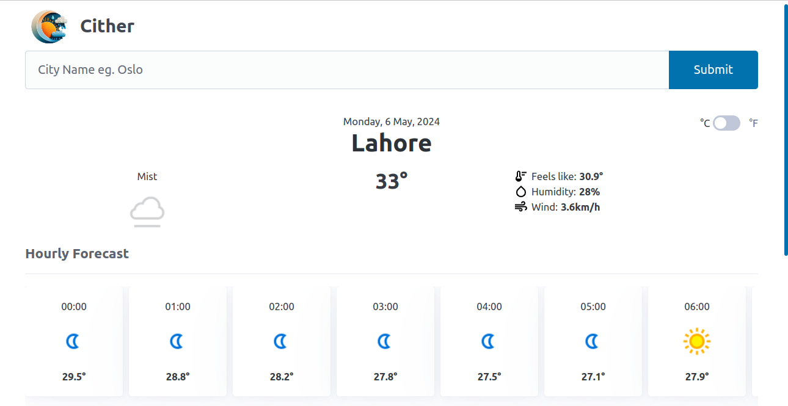
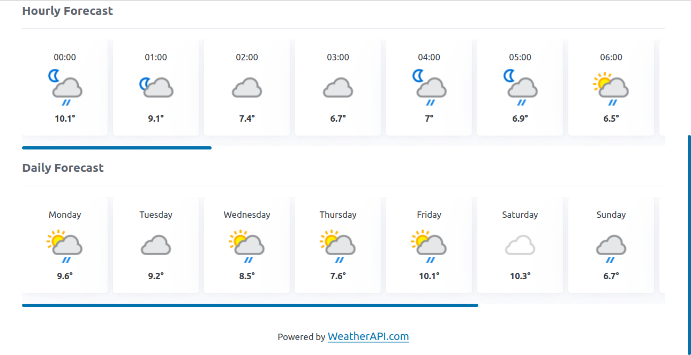

# odin-weather-app

A weather app crafted using vanilla Javascript, directed by The Odin Project.

Integrated WeatherAPI, Webpack, Babel, ESLint and Picocss.

Live Preview => [Cither](https://madaooftheblues.github.io/odin-weather-app/)

## Visuals

> City Weather Information
> 

> Hourly and Daily Forecasts
> 
